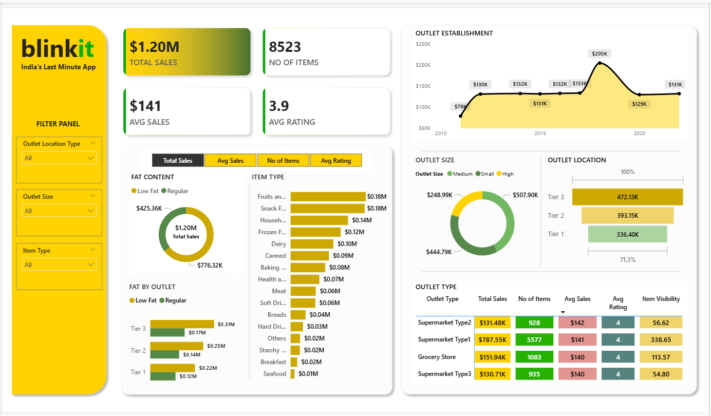

# 🛒 Blinkit Sales Analysis Dashboard (Power BI)

## 📌 Project Overview
This Power BI dashboard analyzes sales performance of Blinkit (India's last-minute delivery app). It provides insights into sales trends, outlet performance, and product categories.

## 📊 Key Metrics
- 💰 Total Sales: $1.20M
- 📦 Number of Items: 8523
- ⭐ Average Rating: 3.9
- 💵 Average Sales: $141

## 📈 Dashboard Features
- Sales trend over years
- Outlet size & location analysis
- Item type performance
- Fat content distribution
- Outlet type comparison

## 📷 Dashboard Preview

## 🛠 Tools Used
- Power BI
- Data Cleaning
- Data Visualization

## 📌 Insights
- Tier 3 outlets generate highest sales
- Medium-sized outlets dominate performance
- Fruits and Snacks are top-selling categories
- Supermarket Type 1 has highest number of items

## 🚀 Author
Jeeva S
